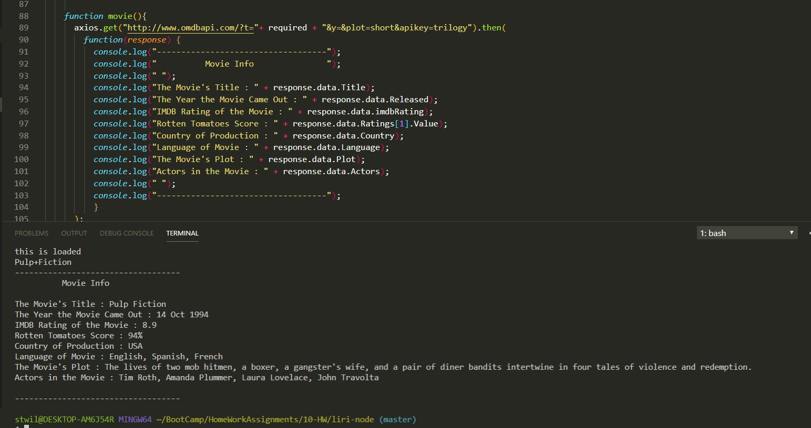

# liri-node
##Overview of Assignment

###In this assignment we were tasked with creating a command line LIRI or Language Interpretatioin and Recognition Interface application that would take in commands and retund spcific JSON deliverd data based on th category of input the user desired. The four basic line comaand we were instructed to create were:
*Movie-this - This command would take the users input movie title and retun 8 seprate data point pertaining to the movie
*Spotify-this-Song - This command would take the users input of a song name and return four data points pertaining to the song
*Concert-this - This command would take in user input and display three points of data based on the concert by the band requested
*Do-What-I-Say - This command would read data from a text file and proceed to run the applicable liri command from the three listed above and retunr data

##Screen Shots of Terminal activity for each command

###Movie-this uer input node liri.js movie-this <movie name>
